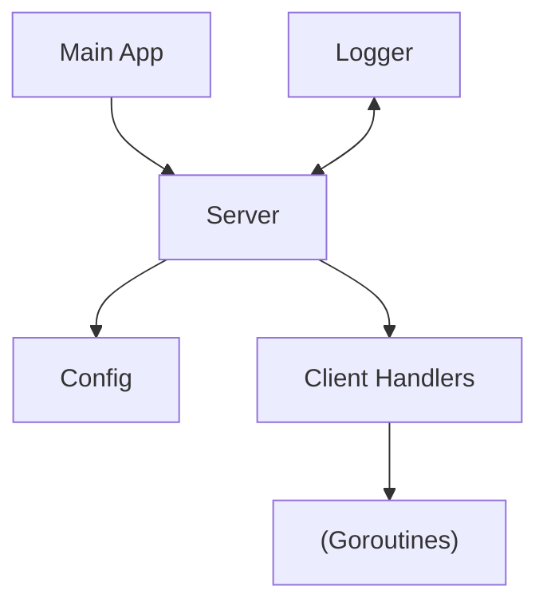

# Time Server

[](https://goreportcard.com/report/github.com/ifzahri/progjar-timeserver)
[](https://godoc.org/github.com/ifzahri/progjar-timeserver)
[](https://opensource.org/licenses/MIT)

| Nama | NRP |
|----------|-----------|
| Iftala Zahri Sukmana   | 5025221002 |

## Instalasi

### Prasyarat

- Go 1.16 atau lebih tinggi

### Langkah Instalasi

1. Clone repository:
   ```bash
   git clone https://github.com/ifzahri/progjar-timeserver.git
   cd timeserver
   ```

2. Build project:
   ```bash
   go build -o timeserver
   ```

## Penggunaan

### Menjalankan Server

```bash
./timeserver
```

Server secara default akan berjalan pada `0.0.0.0:45000`.

### Opsi Konfigurasi

Anda dapat menyesuaikan konfigurasi dengan flag command line:

```bash
./timeserver -host=localhost -port=8080 -loglevel=debug
```

Flag yang tersedia:
- `-host`: Host address untuk binding (default: "0.0.0.0")
- `-port`: Port untuk listening (default: 45000)
- `-loglevel`: Level log (debug, info, warn, error) (default: "info")

## Protokol Komunikasi

Time Server mendukung protokol berbasis teks sederhana:

| Perintah | Deskripsi | Respons |
|----------|-----------|---------|
| `TIME`   | Mendapatkan waktu server saat ini | `JAM HH:MM:SS` |
| `QUIT`   | Menutup koneksi | *Koneksi ditutup* |

### Contoh Interaksi

```
$ nc localhost 45000
Welcome to Time Server. Send 'TIME' for current time, 'QUIT' to disconnect.
TIME
JAM 15:04:05
QUIT
```

## Struktur Project

```
timeserver/
├── main.go       # Entry point aplikasi
├── config.go     # Konfigurasi server
├── logger.go     # Sistem logging
├── server.go     # Implementasi server
├── go.mod
└── README.md
```

## Arsitektur

Time Server dibangun dengan arsitektur berikut:

1. **Main Application** - Menginisialisasi server, mengelola sinyal shutdown
2. **Server Component** - Menangani koneksi jaringan dan protokol
3. **Configuration** - Mengelola pengaturan server
4. **Logger** - Menyediakan fasilitas logging terstruktur

### Diagram Alur



## Konkurensi dan Keamanan Thread

Time Server menggunakan model konkurensi Go dengan:

- **Goroutines** untuk menangani koneksi klien secara bersamaan
- **Mutex/RWMutex** untuk melindungi variabel bersama
- **WaitGroup** untuk penghentian yang terkoordinasi
- **Context** untuk pengelolaan lifecycle

## Penanganan Error

Server mengimplementasikan strategi penanganan error yang komprehensif:

- Error wrapping dengan `fmt.Errorf` dan `%w`
- Sentinel errors untuk error yang umum
- Timeout untuk operasi I/O
- Graceful degradation saat terjadi error

## Acknowledgments

- [Go Documentation](https://golang.org/doc/)
- [Effective Go](https://golang.org/doc/effective_go.html)
- [Go Concurrency Patterns](https://blog.golang.org/concurrency-patterns)